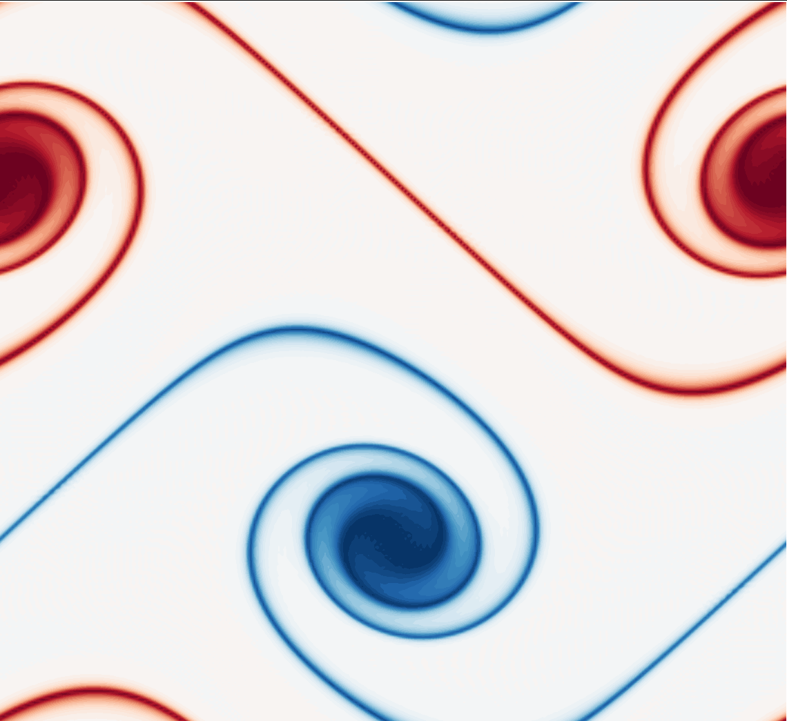

# Decaying Turbulence in Python (OOP)


[](https://travis-ci.org/marinlauber/OOpyPST)

[](https://coveralls.io/github/marinlauber/OOpyPST?branch=master)

Pseudo-spectral collocation code for two-dimensional turbulence simulations written in object-oriented python.

## Getting Started

These instructions will get you a copy of the project up and running on your local machine for development and testing purposes.

### Prerequisites

To run the code provided in this repository, you will need standard python packages, such as `numpy` and `matplotlib`. These should already be installed on most machines.

To use the `master` branch of this code (the fast one!), you will need to have `pyFFTW` installed. Installation instructions can be found [here](https://pypi.org/project/pyFFTW/).

Alternatively, you can create a new conda environment using the `environment.yml` file provided. First, got in the '2D-Turbulence-Python' cloned repository and creat the new environment
```
$ conda env create -f environment.yml
```
This will create a new conda environment called `2D-Turbulence-Python`. Then activate it
```
$ conda activate 2D-Turbulence-Python
```
This will install all the required packages and allows you to use this repo.

This repository contains three (as of today) branches, the `master` branch that includes the pseudo-spectral code running with the `pyFFTW` library, the `CDS` branch that contains the high-order (up to 6th) compact difference scheme version and the `numpy` branch that contains a numpy-only version of the code. When the repository has been cloned/downloaded, you can switch between branches using
```
git checkout numpy (or CDS)
```
to switch to the desired branch. The solver is implemented such that functions calls perform the same tasks on each branch.

### Running The Tests

Once you are happy with the version you are going to use, check that everything works by running the validation script
```
python valid.py
```
This runs a simulation of the [Taylor-Green Vortex](https://en.wikipedia.org/wiki/Taylor%E2%80%93Green_vortex) for which we have an analytical solution. The output should look similar to this
```
Starting integration on field.

Iteration    100, time   0.020, time remaining   0.079. TKE: 0.180  ENS: 23580.54
Iteration    200, time   0.041, time remaining   0.058. TKE: 0.129  ENS: 16934.10
Iteration    300, time   0.061, time remaining   0.038. TKE: 0.092  ENS: 12157.35
Iteration    400, time   0.082, time remaining   0.017. TKE: 0.066  ENS: 8725.782

Execution time for 484 iterations is 2.737 seconds.
The L2-norm of the Error in the Taylor-Green vortex on a 128x128 grid is 1.362e-10.
The Linf-norm of the Error in the Taylor-Green vortex on a 128x128 grid is 2.725e-10.
```
You should get errors in both norms close to the values displayed above.

This repo also contains some more basic test, that can be run using `pytest`

```
$ pytest
```

## Using the code

Simulations are initialized by defining a grid, and specifying the Reynolds number of the flow
```python
flow = Fluid(nx=64, ny=64, Re=1)
flow.init_solver()
flow.init_field("Taylor-Green")
```
Here we have initialized the Taylor-Green vortex. The solver initiation generates all the working arrays and transforms the initial conditions. Simulations can also be initialized using results from previous runs (these need to have been saved with `flow.save_vort("PATH/", ID)`)
```python
q = np.genfromtxt("PATH/vort_ID.dat")
flow.time = q[0, 0]
flow.init_field(field=q[1:, :])
```
here we reset the flow timer using the time value saved in the `vort_ID.dat` file. The `finish` time of the simulation must be adjusted accordingly, as well as the `ID` if the field is saved. This allows user-generated field to be used, within the limitations of the method (periodic boundary conditions). The main loop of the solver is called as
```python
# loop to solve
while(flow.time<=finish):
    flow.update()
    if(flow.it % 500 == 0):
        print("Iteration \t %d, time \t %f, time remaining \t %f. TKE: %f, ENS: %f" %(flow.it,
              flow.time, finish-flow.time, flow.tke(), flow.enstrophy()))
```
Small simulations can also be run live, which can also be handy for de-bugging
```python
flow.run_live(finish, every=100)
```

## Additional Content

For a description of the theory behind this code, or to run other cases, such as a double shear layer, or decaying isotropic turbulence, look at this [notebook](Theory.ipynb).

<!-- <p align="center">
  
</p> -->

## Authors

* **Marin Lauber** - *Initial work* - [github](https://github.com/marinlauber)

## License

This project is licensed under the MIT License - see the [LICENSE](LICENSE) file for details

<!-- ## Acknowledgments

* Hat tip to anyone whose code was used
* Inspiration
* etc -->